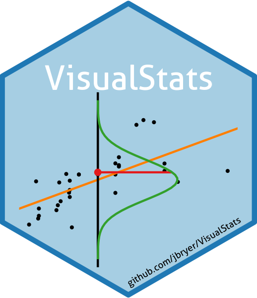

VisualStats: R package for visualizing statistical tests
================



**Authors: Jason Bryer, Ph.D. and Bruce Dudek, Ph.D.**  
**Website: <https://jbryer.github.io/VisualStats/>**

This package contains functions and [Shiny](https://shiny.rstudio.com)
applications designed to visualize statistical tests. The repository
also contains a [Quarto book](https://jbryer.github.io/VisualStats). The
latest version can be installed from Github using the `remotes` package:

``` r
remotes::install_github('jbryer/VisualStats')
```

### Framework for creating Shiny applications

One of the primary goals of using the Quarto book website format is that
Shiny applications can be embedded providing the reader the ability to
interact with many of the statistical visualizations presented. The
[WebR](https://docs.r-wasm.org/webr/latest/) project provides the
framework for embedding R code within HTML pages. Ideally we would load
the `VisualStats` package in WebR and call the functions directly.
Unfortunatley, the WebR framework does not support installing R packages
from source (and according to their documentation, [may likely never
have this
feature](https://docs.r-wasm.org/webr/latest/building.html#:~:text=It%20is%20not%20possible%20to,to%20install%20packages%20in%20webR.)).
However, it is possible to load R scripts from source. The goal here is
to maximize the ways in which Shiny applications can be deployed (using
Shiny server, running locally, and embedded in Quarto documents) while
minimizing the code duplication.

When developing a new Shiny application, the app should be located in
the [`R/`](R/) directory as R package functions (i.e. include [Roxygen
documentation](https://roxygen2.r-lib.org)). In particular there needs
to be at least three functions (note that `FEATURE` should be replaced
with the name of the application):

    #' Shiny UI
    #' @return a Shiny UI object.
    #' @export
    FEATURE_shiny_ui <- function() {
      # Shiny UI code here. Basic siderbar panel provided
      fluidPage(
            sidebarLayout(
                sidebarPanel(
                  # Shiny inputs
                ),
                mainPanel(plotOutput("plot", height = '600px'))
            )
        )
    }

    #' Shiny server
    #' @param input Shiny input object.
    #' @param output Shiny output object.
    #' @param session Shiny session object.
    #' @return a function with Shiny server logic.
    #' @export
    FEATURE_shiny_server <- function(input, output, session) {
      # Shiny server code here
      output$plot <- renderPlot({
        # Plotting code
    })
    }

    #' Run the Shiny server
    #' @param ... other parameters passed to [shiny::shinyApp]
    #' @export
    FEATURE_shiny <- function(...) {
        shiny::shinyApp(ui = FEATURE_shiny_ui, server = FEATURE_shiny_server, ...)
    }

Within the Quarto document where the Shiny application is to be
embedded, add the following code in a `shinylive-r` code chunk. Note
that we need to source the R scripts containing the relevant functions.
Since we are calling these functions outside of the `VisualStats` R
package any package dependencies need to be installed using teh
`webr::install` command and loaded using the `library` command.

```` yml
```{shinylive-r}
#| label: fig-shiny-FEATURE
#| viewerHeight: 600
#| standalone: true
webr::install("ggplot2")
library(ggplot2)
# Include any R scripts that have the implementation of any R functions used
source('https://raw.githubusercontent.com/jbryer/VisualStats/main/R/FEATURE_vis.R')
# Include R script defining the Shiny UI and server
source('https://raw.githubusercontent.com/jbryer/VisualStats/main/R/FEATURE_shiny.R')
shinyApp(ui = FEATURE_shiny_ui, server = FEATURE_shiny_server)
```
````

To deploy the application using Shiny server, create a file called
`app.R` with the following (these are also included in the `inst/shiny`
directory):

    library(VisualStats)
    shinyApp(ui = FEATURE_shiny_ui, server = FEATURE_shiny_server)

### Helpful links

- [Quarto book
  options](https://quarto.org/docs/reference/projects/books.html#sidebar)
- [Search for R packages available as WebR
  packages](https://rud.is/w/webr-pkgs/)
- [Figure options for
  Quarto](https://quarto.org/docs/authoring/figures.html)
- [Code blocks
  options](https://quarto.org/docs/output-formats/html-code.html)
